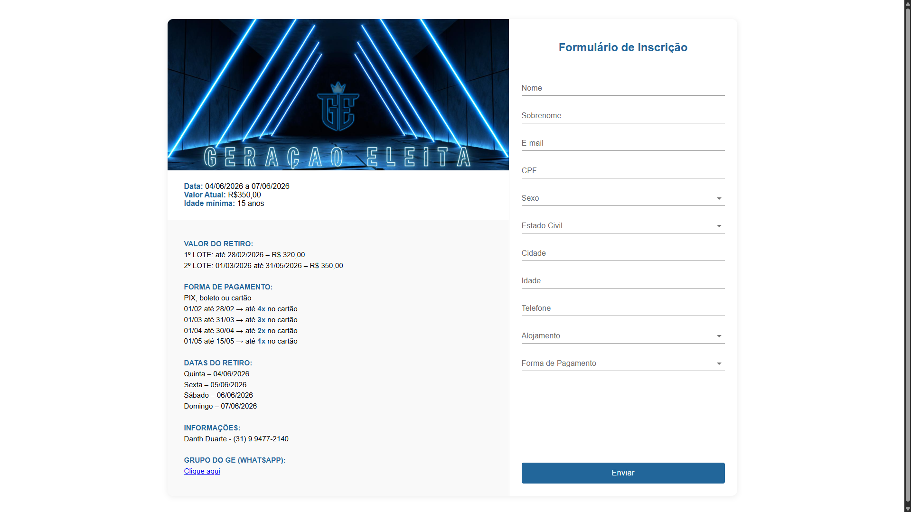

# Formulário de Inscrição – Retiro de Jovens

## Contexto

- Este projeto foi desenvolvido a partir de uma necessidade real durante a organização de um retiro de jovens, que contou com mais de 200 inscrições.
- O processo anterior era manual e descentralizado, com informações sendo enviadas por diferentes canais e pagamentos difíceis de acompanhar.

---

## Problema

Antes da solução:

- Inscrições feitas manualmente
- Envio de comprovantes via WhatsApp
- Alto risco de erros
- Dificuldade para controle de pagamentos
- Processo lento e trabalhoso

---

## Solução

Foi desenvolvido um formulário web responsivo integrado a um fluxo automatizado.

Ao preencher o formulário:

- Um cliente é criado automaticamente na API de pagamentos (ASAAS)
- A cobrança é gerada com status inicial `PENDING`
- O status evolui para `CONFIRMED` e depois `RECEIVED` após o pagamento
- Um webhook atualiza os dados automaticamente
- As informações são registradas em uma planilha no Google Sheets

---

## Padronização de Localidade

Para garantir consistência nos dados de cidade e estado, foi utilizada a API pública do IBGE como fonte de municípios:

```
https://servicodados.ibge.gov.br/api/v1/localidades/municipios
```

Com isso:

- Os nomes de cidades seguem um padrão oficial
- O estado (UF) é associado corretamente a cada município
- Erros de digitação e variações de escrita são evitados
- Os dados permanecem consistentes para uso posterior

---

## Tecnologias

- HTML, CSS, JavaScript e React
- Node.js
- API ASAAS
- Webhooks
- API do IBGE
- Google Sheets
- Vercel

---

## Interface

<p align="center">
  
  
</p>

---

## Resultados

- Mais de 200 inscrições gerenciadas
- Redução de trabalho manual
- Maior confiabilidade nos dados
- Acompanhamento de pagamentos em tempo real

---

## Observação

Este repositório tem como objetivo documentar uma solução aplicada em um cenário real, com foco no problema, na abordagem e no impacto gerado.